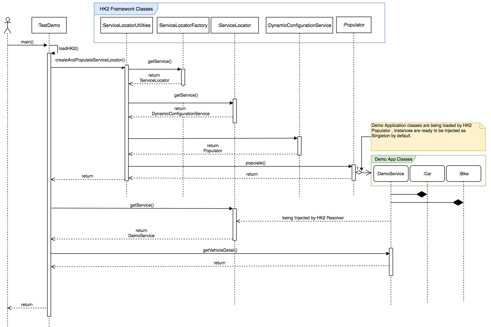

# Context

This project is created to demonstrate how we can use HK2 framework to resolve dependency injection.

Usually, as of today, there is very limited HK2 documentation available in Internet. Latest and most useful documentation site is https://javaee.github.io/hk2/ , however this is also not continuously maintained and updated. Not quite good too for first time learner.

Thus, I am trying to document my experience with HK2, so developers who want to learn HK2 dependency container can quickly pick up and start using it without much hick up :) This will give you a Kick start and then I am sure , when you will explore more with HK2, will learn more about topics/areas which are not covered here. Note, it is still in-progress DRAFT documentation, will be updated as we progress. 

### What do we need to kick start with HK2 ?

* Any IDE else command line build tool is also okay, I am using Intellij
* Familiarity with Maven or Gradle or any other Build system. I am using Gradle here.
* Of course familiarity with Java.. Am I kidding ;)

##### Step 1: get the dependencies
Now, create either Maven or Gradle project in Intellij. If you have created a Maven project then please add following dependencies in pom.xml and if you choose Gradle then add below dependencies in build.gradle file under project root directory.

##### pom.xml for Maven
 
        <properties>
                <hk2.version>2.5.0</hk2.version>
        </properties> 
        <dependency>
             <groupId>org.glassfish.hk2</groupId>
             <artifactId>hk2-api</artifactId>
             <version>${hk2.version}</version>
         </dependency>
         <dependency>
             <groupId>org.glassfish.hk2</groupId>
             <artifactId>hk2-locator</artifactId>
             <version>${hk2.version}</version>
         </dependency>
         <dependency>
             <groupId>org.glassfish.hk2</groupId>
             <artifactId>hk2-metadata-generator</artifactId>
             <version>${hk2.version}</version>
             <scope>provided</scope>
         </dependency>

##### build.gradle for Gradle

        dependencies {
            compile group: 'org.glassfish.hk2', name: 'hk2-api', version:'2.5.0'
            compile group: 'org.glassfish.hk2', name: 'hk2-locator', version:'2.5.0'
            compileOnly group: 'org.glassfish.hk2', name: 'hk2-metadata-generator', version:'2.5.0'
        }

##### Step 2: Create required Classes and Annotate

Go through all the below classes and its documentation to have better understanding about HK2 APIs and Annotation 

        TestDemo -          This is a test class to trigger the DemoService via HK2 Dependency Injection framework.
        DemoService -       Annotated with @Service. This class represents a Service containing multiple APIs (methods) for external consumptions. This is a Service class as per HK2 framework and can be injected as and when required by external caller. 
        DemoContract -      Annotated with @Contract.This is an Interface of possible Services which will expose defined public APIs (methods) for client consumptions. As per HK2 framework, Services can be injected as and when necessary.
        Vehicle -           Annotated with @Contract. This is a Business Interface and declaring as Contract as per HK2 framework for identifying it as Interface of Injectable Business Objects.
        Bike -              Annotated with @Service. This class is an implementation of Vehicle interface but with characteristics of a Bike.
        Car -               Annotated with @Service. This class is an implementation of Vehicle interface but with characteristics of a Car.
        MovementStatus -    This is an Enum class defining possible movement patterns which are constants.           

##### Step 3: Create inhabitant file 
Inhabitant file contains all Service Definitions that HK2 Dependency container scans and loads all related objects. There are three way of creating these entries. 

1. Manually. LOL ;)
2. Using inhabitant file generator tool provided by HK2 
3. Best one : Using Maven or Gradle plugin. We already added the hk2-metadata-generator plugin in Maven or Gradle dependencies.

Third option is easy & simplest, hence not discussing about first two options here. Gradle or Maven plugin will take care of inhabitant file generation as soon as you trigger fresh build. Though, there is a glitch/bug , hence you may need to sometime fo a clean build if you see weird Exceptions which are basically due to incomplete inhabitant file.   

###### Sample inhabitant file content:

        #
        # Generated by hk2-metadata-generator
        #
        
        [in.dhrubo.demo.bo.Bike]S
        contract={in.dhrubo.demo.bointerface.Vehicle}
        name=Bike
        qualifier={javax.inject.Named}
        
        [in.dhrubo.demo.bo.Car]S
        contract={in.dhrubo.demo.bointerface.Vehicle}
        name=Car
        qualifier={javax.inject.Named}
        
        [in.dhrubo.demo.service.DemoService]S
        contract={in.dhrubo.demo.contract.DemoContract}

##### Step 4: run the program

TADA ! just run TestDemo java main class either from Intellij or running Maven/Gradle command line.

###### Gradle : 
There are many ways, but simplest option is to add following lines in build.gradle

        apply plugin: 'application'
        mainClassName = "in.dhrubo.demo.TestDemo"
         
Gradle command to run the application : 

        gralde clean
        gradle build
        gradle run

###### Maven :

        mvn clean install
        mvn compile
        mvn exec:java -Dexec.mainClass="in.dhrubo.demo.TestDemo"

#### Concept: 

We have successfully run the program and now lets deep dive into concept and workflow around how HK2 works.

###### Terminology

* @Contract - This annotation is used by HK2 during automatic class analysis to indicate that a class or interface should be included in the list of contracts for a service   
* @Service -  In order to mark a concrete implementation class as one that should be available as a service you annotate your class with @Service.   
* @Named - This is optional, however it is best practice to use it with specific name to avoid any conflict based on multiple implementation from same @Contract. If you use the Named qualifier without specifying a name then the name you get is the class name without the package.

###### Little advanced Annotations:  
* @Stub - The HK2 metadata generator can also generate implementation classes based on abstract classes. Using Stub means that this abstract class may not need to be updated if the underlying interface or class has an added method.  
* @Rank - The best instance of a service is a service with the highest ranking or the lowest service id. The ranking of a service is found in its Descriptor and can be changed at any time at run time. The Rank annotation will work when placed on the abstract class, so the stub can be given higher priority than the replacement class. Higher @Rank number will take priority while injecting Service Object by default.     
* @Qualifier - Services can also be qualified with annotations called qualifiers. Qualifiers are annotations that are themselves annotated with @Qualifier

There are few others too e.g. @Retention, @Target   

###### Life Cycle Annotations:
There are few life cycle annotations available e.g. @PostConstruct @PostDestroy, however skipping detail discussion about these for now.   

###### What is Service Descriptor & Binder ?

* *Descriptor* : A Descriptor is a bean-like structure that describes a service declaration in HK2. A descriptor is comprised only of basic objects such as String or boolean (e.g., not Class or Annotation}. A described service does not need to be classloaded in order to have a Descriptor. However, this does imply that a Descriptor will have some loss of information when compared to a classloaded service, which is described with an ActiveDescriptor. For example, a Descriptor can know that a service has a qualifier named Foo, but will not know (without the use of Metadata) what values Foo contains.
  
* *Binder* : The binder is used in conjunction with the ServiceLocatorUtilities.bind(org.glassfish.hk2.api.ServiceLocator, Binder...) method in order to add (or remove) services to a ServiceLocator. This is useful when you have sets of related services to add into the locator.  

#### Component & Design walk-through 

Following components of HK2 container are most important ones.

1. ServiceLocator
2. Inhabitant Metadata
3. ServiceLocatorUtilities  

Complete HK2 APIs are available here > https://javaee.github.io/hk2/apidocs/index.html?org/glassfish/hk2/api/Context.html

Below sequence diagram may help you to understand how Bike or Car objects are injected in this example.

   

##### How HK2 Loads 

Primarily there are two ways that HK2 container loads all injectable Service Objects as following 
                        
1. *via Service Locator and inhabitant file* - ServiceLocator is Interface (Contract) to interact with HK2 2.0 API. This scans all available services and return. HK2 APIs provide a stand alone class ServiceLocatorUtilities which has methods to trigger HK2 container loading e.g. createAndPopulateServiceLocator(). This methods need to be called from your initial part of main method if it is a stand alone program. If you are using any server container , you can happily include this call within any boot loader mechanism. As soon as ServiceLocatorUtilities.createAndPopulateServiceLocator() is called, HK2 framework code gets trigger and scans all the classes avaialble marked with @Contract and @Service annotations from inhabitant file. Default location of inhabitant file is ~/META-INF/hk2-locator/default , however there is way to place this file at your preferred location. Now, when HK2 frameworks reads all definitions of injectable Objects and its injectable properties like @Named, @Rank , @Singleton etc. it will know how to create those Objects as per client need and provide the same where marked with appropriate @Inject annotation. There are three way of injecting Objects at 1) Property 2) Method & 3) Constructor level.     
2. *via implementing and registering AbstractBinder* - This approach also works similarly however just HK2 triggering mechanism is different. Here, you can implement AbstractBinder as following and bind your Service Object class with HK2. You need to implement configure() method and invoke bind to include the definition of your Service Object class with HK2.  
        
        AbstractBinder binder = new AbstractBinder() {
              @Override  
              protected void configure() {
                bind(ServiceImpl.class).to(ServiceImpl.class).in(Singleton.class);
              }
            };
        ServiceLocatorUtilities.bind(binder);
   Now, you just need to register this AbstarctBinder with your server container or by invoking  ServiceLocatorUtilities.bind(binder); as given in above code snippet. Here ServiceImpl is your injectable Service class. This is basic idea of loading your injectable objects. However there are many more underlying concepts which you can go through and learn as you start using this HK2 Dependency Injection framework.  

There are many more topic in HK2 , but I like to limit this for now and will be including others as and when required or requested by readers. Please feel free to provide your opinion in comment section. I will take action accordingly.

Want to explore further in your own with some help , please go through https://javaee.github.io/hk2/extensibility.html try and learn more :)

##### DEBUGGING Observations:

- While adding multiple implementation of a Contract >> Locator is unable to returning service . Requires clean build as inhabitant files recreated without all Service definitions.

- Refactoring class name requires clean build to regenerate service definition in inhabitant file

- Sometimes, inhabitant file gets overwritten after running the application from Intellij and this forces us to do a clean build once again.

- declaring class level variable as static and with @Inject annotation will break HK2. I may not understand this yet, still searching for answer. 

##### Limitations:
 
This is first opinion which may change as I learn HK2 more & more, hence do not take this as granted for now. This is a mare viewpoint sharing for further discussion. My experience with HK2 is not as expected and I suggest you take special care while debugging. You may face unwanted exceptions that you would not foresee. It is not 100% reliable and seems unstable to me while generating inhabitant definition and as well as injecting objects. There are limitations that you need to be aware of. It requires fresh clean build every time if you make any injection related changes including refactoring of Java classes, which is to some extent logical if you change Contract & Service name. However, while simply running the program, I have observed that it may overwrite inhabitant file with incomplete detail. This could be problem with maven hk2-metadata-generator dependency module or IntelliJ (which I don't think). 

There are other Dependency Injection framework available in market , you may want to try with e.g. Java EE6 CDI ,Guice , Dagger, Pico etc. If your design choice is not limited with only DI, you can also try OSGi, Spring etc. which are most reliable and battle proven framework in java world.

  
